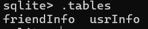
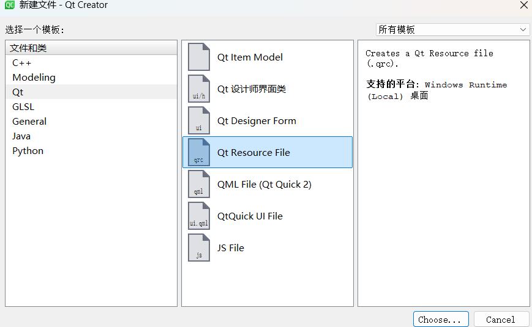
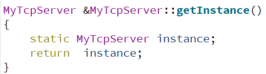

# 开发日志

## 1 数据库

### 1.1 技术栈

- sqlite3 version 3.37.2

### 1.2 数据库创建

```sqlite
sqlite3 ./cloud.db
```

### 1.3 数据表创建

#### 用户信息表


```sqlite
sqlite> create table usrInfo(id integer primary key autoincrement,
   ...> name varchar(32),
   ...> pwd varchar(32));
```

### 

插入

```sqlite
sqlite> insert into userInfo(name,pwd) values('jack','jack'),
   ...> ('rose','rose')
   ...> ('lucy','lucy');
```


#### 用户好友表


```sqlite
sqlite> create table friendInfo(id integer not null,
   ...> friendId integer not null,
   ...> primary key(id,friendId));
```



## 2 客户端

### 2.1 技术栈

- QT5.14.2 https://mirrors.tuna.tsinghua.edu.cn/qt/official_releases/online_installers/qt-unified-windows-x64-online.exe

### 2.2 项目配置


### 2.3 创建项目


### 2.4 配置文件

- 添加

****


### 2.5 客户端开发

#### 2024.7.23 配置文件加载


#### 2024.7.23 服务器连接


- 连接服务器以及绑定信号槽


#### 2024.7.25 界面信号槽


### 2.6 服务端开发

#### 2024.7.24 服务器实现流程


- 让自定义类支持信号槽


- 单例模式


当static定义在局部，会导致该变量在程序的整个生命周期内只被初始化一次，并且保留其值直到程序结束



- 监听端口


- 重写虚函数


#### 2024.7.25 协议设计


### 2.7 柔性数组

int d[] 不占空间


